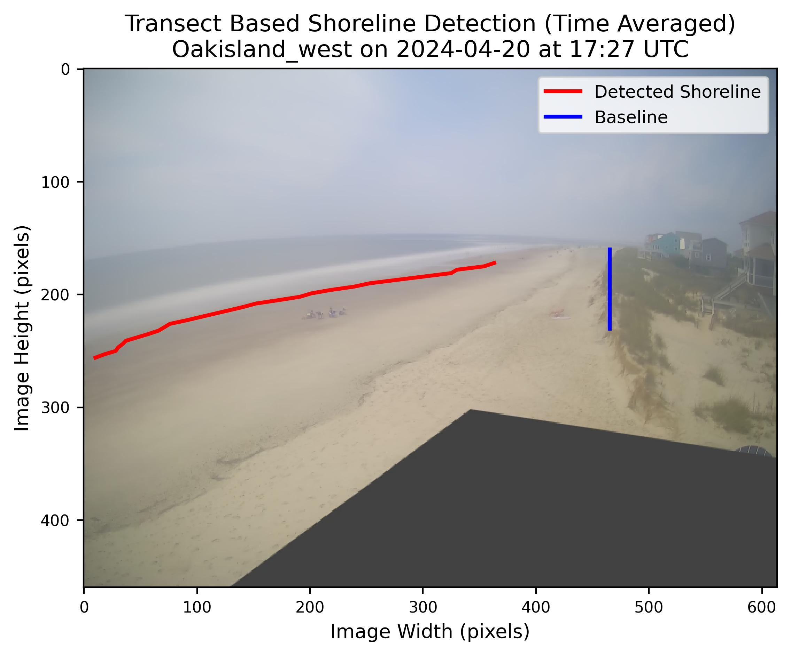

# WebCOOS Shoreline Detection

API for performing shoreline detection on pre-configured shoreline imagery.

Developed by:

*   TODO



## Local setup

It is recommended to create a new Python virtual environment using `conda`, or
its faster alternative, `micromamba`.

`conda` environment creation and activation:

```shell
conda env create -f environment.yml
conda activate webcoos_shoreline_detection
```

`micromamba` environment creation and activation:

```shell
micromamba create -f environment.yml
micromamba activate webcoos_shoreline_detection
```

## FastAPI Serving

The models can be served using a FastAPI server. The server allows the POSTing
of image URLs and raw image (file uploads). The model to use is supplied as URL path parameters.

```shell
POST /{method_name}/{method_version}/upload - Image file upload endpoint
```

The server can be started with

```shell
uvicorn api:app
```

The server can be tested with the `test_api.py` file. It will save images to the `output` folder based on the `model` and `version` requested.

```shell
python ./test/test_api.py
```

The FastAPI server can also be served using Docker:

```shell
docker build -t webcoos_shoreline_detection:latest .
docker run --gpus all --rm --name shoreline_detector -v $(pwd)/outputs/docker:/outputs -p 8000:8000 webcoos_shoreline_detection
```

And then tested the same as running it outside of Docker

```shell
python ./test/test_api.py
```
